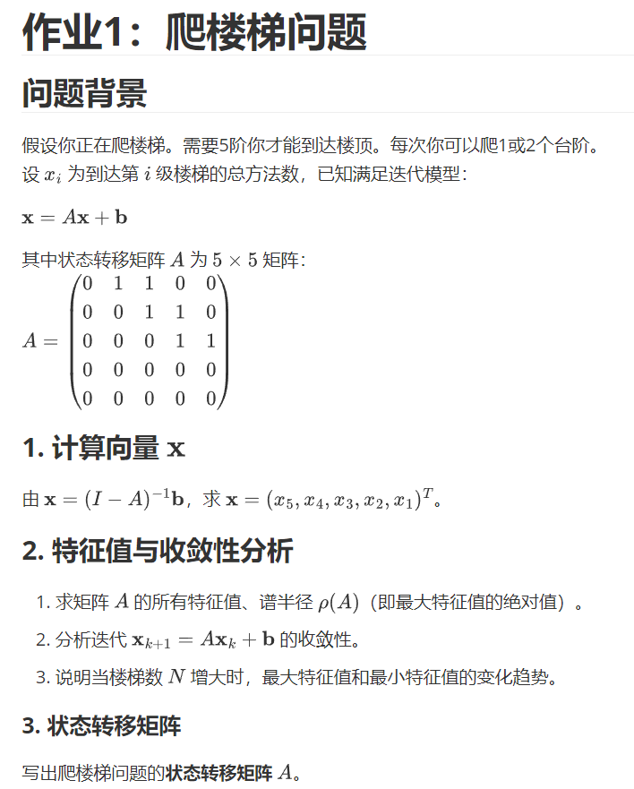

<!--
强化学习作业

强化学习-叶助教2026年03月19号 星期四 22:51

以上是本周强化学习课的作业1，截至时间3月25日晚，提交至邮箱1293657103@qq.com。

以【添加附件】的形式发送，不要把内容写在邮件的正文部分。

作业按照＂学号-姓名-作业n＂格式命名。

如＂3722022345678–张三–作业1＂。
-->
# 强化学习作业

强化学习-叶助教2026年03月19号 星期四 22:51

以上是本周强化学习课的作业1，截至时间3月25日晚，提交至邮箱[1293657103@qq.com](mailto:1293657103@qq.com)。

以【添加附件】的形式发送，不要把内容写在邮件的正文部分。

作业按照＂学号-姓名-作业n＂格式命名。

如＂3722022345678–张三–作业1＂。

---
